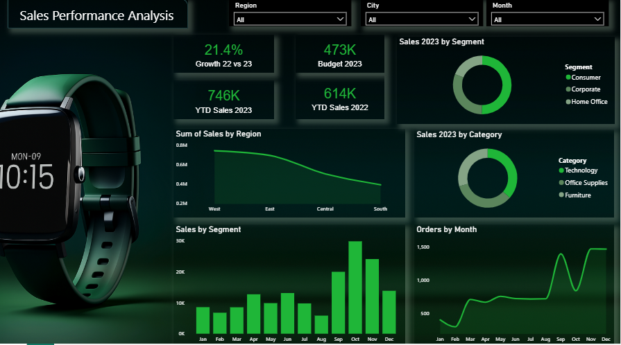

# 📊 Sales Performance Analysis Dashboard - Power BI

This project is a **Sales Performance Analysis Dashboard** built using **Microsoft Power BI**, designed to visualize and monitor key sales metrics across various dimensions such as region, segment, category, and time.

## 📌 Objective

The main objective of this dashboard is to provide an interactive and comprehensive overview of sales performance for the year 2023, enabling stakeholders to:

- Track year-to-date (YTD) sales
- Compare current year vs previous year performance
- Monitor performance against budget goals
- Analyze sales by region, segment, and category
- Identify monthly order trends

---

## 🧩 Key Features

- 📈 **YTD Performance Comparison**  
  Visual comparison of 2023 vs 2022 sales and growth rate.

- 🗺️ **Regional Sales Distribution**  
  A line chart showing total sales by region (West, East, Central, South).

- 👥 **Segment Analysis**  
  Donut chart and bar visuals to analyze sales performance by customer segments (Consumer, Corporate, Home Office).

- 🗃️ **Category-wise Sales**  
  Distribution of sales by product categories (Technology, Office Supplies, Furniture).

- 🗓️ **Monthly Order Trends**  
  Line graph showing the trend in orders over the months of 2023.

- 🎯 **Dynamic Filters**  
  Dropdown slicers for Region, City, and Month for interactive filtering.

---

## 🛠️ Tools Used

- Microsoft Power BI
- DAX (Data Analysis Expressions)
- Power Query Editor

---

## 🚀 How to Use

1. Download the `.pbix` file.
2. Open it using Power BI Desktop.
3. Use the slicers to filter data by region, city, or month.
4. Explore visualizations to gain insights into sales performance.

---

## 📈 Insights Derived

- The sales have grown by **21.4%** compared to the previous year.
- **Technology** and **Consumer segments** contribute to the major share of sales.
- Highest sales observed in the **West** region.
- A significant spike in **September** orders.

---

## 📬 Connect with Me

If you have any questions or want to collaborate, feel free to reach out via https://www.linkedin.com/in/rifatdipu/

---

